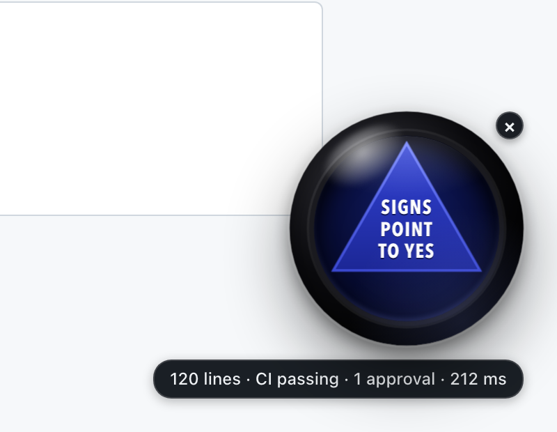

# Magic Jev

A Magic 8 Ball for pull requests. Open a PR, click the ball, and it answers "should I approve this?" with one of the 20 classic phrases. The answer isn't random: the PR's real signals go to [Jev](https://typesafe.ai), a typed-decision model that answers in about 200 ms, which is fast enough to land while the ball is still shaking.



It's a toy with a real point. Jev doesn't write text. It gets structured state and picks one option from a short list, so it can sit inside an interaction that a chat model would make you wait for.

**The ball never acts.** It doesn't approve, comment or merge. It doesn't read your code either: it answers "can this be approved on a light read?" from the numbers below, and shows its reason.

## How it decides

The extension reads the PR through the GitHub API and boils it down to nine signals:

| Signal | Meaning |
|---|---|
| `ci` | passing, failing, pending or none, from commit statuses and check runs |
| `linesChanged`, `filesChanged` | size of the diff |
| `docsOnly` | every changed file is `.md`, `.mdx`, `.txt` or under `docs/` |
| `testsTouched` | any changed path contains "test" or "spec" |
| `approvals`, `changesRequested` | each reviewer's latest review |
| `isDraft`, `authorIsBot` | as GitHub reports them |

Those go to a small server, which asks Jev to pick one of four verdicts:

| Verdict | When | Sounds like |
|---|---|---|
| **yes** | CI passing, and docs-only or at most 50 lines | "It is certain." |
| **lean_yes** | CI passing, 51 to 300 lines | "Signs point to yes." |
| **unclear** | CI pending or missing, or 301 to 800 lines: it needs a real read | "Concentrate and ask again." |
| **no** | CI failing, a draft, changes requested, or over 800 lines | "Don't count on it." |

Jev picks the verdict; the extension picks a random phrase from that verdict's five, so you get the variety of an 8 Ball without the coin flip. The line under the ball says why ("CI failing · 912 lines") and how long Jev took.

The criteria are plain English in [`packages/core/src/criteria.ts`](packages/core/src/criteria.ts). The same rule is also written as code (`expectedVerdict`) so that Jev can be checked against it: see [Checking Jev](#checking-jev).

## Set it up

You run your own copy: a tiny server on Vercel, and the extension loaded unpacked in Chrome. About ten minutes. You need Node 22+, a [Vercel](https://vercel.com) account and a GitHub account.

### 1. The server

```bash
git clone https://github.com/acharyaanusha/magic-jev && cd magic-jev
corepack enable && pnpm install

npx vercel link                                    # create a new project when asked
openssl rand -base64 24 | tr -d '\n' > .env.passphrase   # gitignored; you'll paste it in step 3
npx vercel env add ASK_PASSPHRASE production < .env.passphrase
npx vercel deploy --prod
```

- `ASK_PASSPHRASE` is a secret the extension sends with every request; the server refuses anything without it. It matters: the route spends your AI Gateway credits, so it must not be open to the world.
- Jev is reached through [Vercel AI Gateway](https://vercel.com/ai-gateway) as `typesafe-ai/jev`. On a Vercel deployment the Gateway authenticates by itself; there is no key to set. Your team does need Gateway credits: on the free tier our calls were rate-limited until we added a few dollars. One ask is one Jev call and costs a small fraction of a cent.

Check it answers:

```bash
MAGIC_JEV_URL=https://your-project.vercel.app MAGIC_JEV_KEY=your-passphrase pnpm verify:criteria
```

### 2. The extension

```bash
pnpm build:extension
```

In Chrome, open `chrome://extensions`, turn on **Developer mode**, click **Load unpacked** and choose `packages/extension/dist`.

### 3. The options page

Open any GitHub pull request. The ball appears; click it, then click the underlined "open the options page first". (Later you'll find the page under the puzzle-piece icon → Magic Jev → Options.)

- **GitHub token**: a [classic token](https://github.com/settings/tokens/new) with the `repo` scope, which covers every PR you can open in your browser. If you only care about public PRs, a classic token with no scopes at all is enough, and is read-only. Fine-grained tokens are a trap here: they only cover repositories you own, and they can't read checks on private ones.
- **Server URL**: your deployment, for example `https://your-project.vercel.app`. It has to be a `*.vercel.app` address (or `http://localhost` for `vercel dev`); for a custom domain, add it to `host_permissions` in `packages/extension/static/manifest.json` and rebuild.
- **Passphrase**: the contents of `.env.passphrase` from step 1 (`pbcopy < .env.passphrase` on a Mac).
- **Show the ball on every pull request**: off, the ball only appears on PRs that request your review. On, it appears on every PR, which is what you want for trying it out.

Press **Test**. You should see your GitHub login and `Server: yes in … ms`. Press **Save**, reload the PR, click the ball.

## When the ball says "Reply hazy, try again"

That's the ball's error state, and the line under it says what went wrong.

| The line says | What to do |
|---|---|
| this token cannot see this repository | The token doesn't cover this repo. Use a classic token with `repo`. For an organisation with SSO, authorise the token for it. |
| this token cannot read the checks | A fine-grained token on a private repo. Use a classic token. |
| GitHub token rejected | The token was revoked, regenerated or mistyped. Paste the current one. |
| server passphrase rejected | The passphrase doesn't match `ASK_PASSPHRASE` on the deployment. |
| out of Gateway credits | Top up AI Gateway credits on your Vercel team. |
| Jev did not answer in time | See below. Click again. |

**Jev sometimes doesn't answer.** In our runs roughly 1 call in 30 never came back, in bursts. The server gives each attempt 1.5 seconds and asks once more before giving up, so a bad moment costs about 3 seconds and one hazy reply.

**On a repo with no CI, every PR is "unclear".** That's the rule working: with no checks there's nothing to say the change is safe.

## Checking Jev

`pnpm verify:criteria` sends 42 made-up pull requests through your deployed server, clustered around the thresholds (49, 50, 51 lines and so on), and compares each of Jev's verdicts with the coded rule. Across five runs of ours, every answer Jev gave matched the rule, at about 200 to 250 ms each. If you reword the criteria, run it again before trusting the ball.

## Privacy

- Your GitHub token and the passphrase are kept in the extension's storage in your browser. The token is only ever sent to `api.github.com`.
- Only the background worker holds them. The script that draws the ball on github.com never sees either.
- Your server receives the nine signals above and nothing else: no repo name, no PR title, no code.
- There are no analytics.

## Development

```bash
pnpm test              # unit tests: signals, the rule, the server route, GitHub calls
pnpm typecheck
pnpm build:extension   # then press the reload arrow on chrome://extensions
```

- `packages/core`: signals, criteria, the coded rule, the phrases. Pure functions.
- `packages/server` and `api/ask.ts`: the one route that asks Jev.
- `packages/extension`: the background worker (every network call), the ball, the options page.

The design notes are in [`docs/superpowers/specs`](docs/superpowers/specs). Next up is the same ball for calendar invites: "should I take this meeting?"

## Credits

Jev is by [TypeSafe AI](https://typesafe.ai), reached through [Vercel AI Gateway](https://vercel.com/ai-gateway) with the [AI SDK](https://ai-sdk.dev)'s `evaluate`. This project isn't affiliated with TypeSafe, Vercel, GitHub or Mattel. Magic 8 Ball is a trademark of Mattel; this is a fan-made homage.

## Licence

[MIT](LICENSE).
