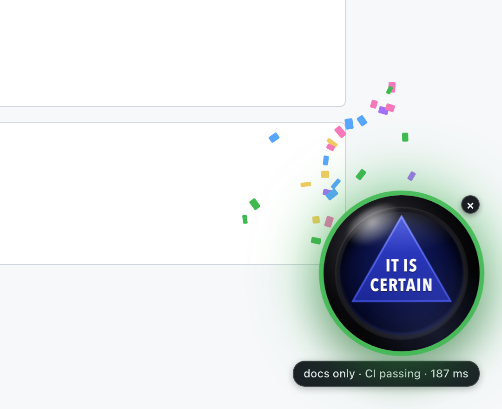

# Magic Jev

A Magic 8 Ball for pull requests. Open a PR, click the ball, and it answers "should I approve this?" with one of the 20 classic phrases. The answer isn't random: the PR's real signals go to [Jev](https://typesafe.ai), a typed-decision model that answers in about 200 ms, which is fast enough to land while the ball is still shaking.



It's a toy with a real point. Jev doesn't write text. It gets structured state and picks one option from a short list, so it can sit inside an interaction that a chat model would make you wait for.

**The ball never acts.** It doesn't approve, comment or merge. It doesn't read your code either: it answers "can this be approved on a light read?" from the numbers below, and shows its reason.

## How it decides

The extension reads the PR through the GitHub API and boils it down to nine signals:

| Signal | Meaning |
|---|---|
| `ci` | passing, failing, pending or none, from commit statuses and check runs |
| `linesChanged`, `filesChanged` | size of the diff |
| `docsOnly` | every changed file is `.md`, `.mdx`, `.txt` or under `docs/` |
| `testsTouched` | any changed path contains "test" or "spec" |
| `approvals`, `changesRequested` | each reviewer's latest review |
| `isDraft`, `authorIsBot` | as GitHub reports them |

Those go to a small server, which asks Jev to pick one of four verdicts:

| Verdict | When | Sounds like |
|---|---|---|
| **yes** | CI passing, and docs-only or at most 50 lines | "It is certain." |
| **lean_yes** | CI passing, 51 to 300 lines | "Signs point to yes." |
| **unclear** | CI pending or missing, or 301 to 800 lines: it needs a real read | "Concentrate and ask again." |
| **no** | CI failing, a draft, changes requested, or over 800 lines | "Don't count on it." |

Jev picks the verdict; the extension picks a random phrase from that verdict's five, so you get the variety of an 8 Ball without the coin flip. A confident yes gets confetti. The line under the ball says why ("CI failing · 912 lines") and how long Jev took.

The criteria are plain English in [`packages/core/src/criteria.ts`](packages/core/src/criteria.ts). The same rule is also written as code (`expectedVerdict`) so that Jev can be checked against it: see [Checking Jev](#checking-jev).

## Install

No account, no keys, no server. About a minute.

1. Download **magic-jev.zip** from the [latest release](https://github.com/acharyaanusha/magic-jev/releases/latest) and unzip it.
2. In Chrome, open `chrome://extensions`, turn on **Developer mode** (top right), click **Load unpacked** and choose the unzipped folder.
3. Open any public pull request on GitHub, say one from [the demo repo](https://github.com/acharyaanusha/magic-jev-demo/pulls), and click the ball.

That's it. Out of the box the ball appears on every pull request and talks to a shared server.

### Add a GitHub token (optional)

Without a token the extension reads GitHub anonymously, which covers public pull requests for about a dozen asks an hour. Add one to:

- ask about pull requests in **private repositories**;
- ask as often as you like;
- have the ball appear **only on pull requests that request your review**, and get a desktop notification with an "Ask Magic Jev" button when a new one arrives.

Open the options page (puzzle-piece icon → Magic Jev → Options) and paste a [classic token](https://github.com/settings/tokens/new) with the `repo` scope. Fine-grained tokens are a trap here: they only cover repositories you own, and they can't read checks on private ones. For an organisation with SSO, authorise the token for it. Press **Test**, then **Save**.

## When the ball says "Reply hazy, try again"

That's the ball's error state, and the line under it says what went wrong.

| The line says | What to do |
|---|---|
| this pull request is private: add a GitHub token | Click the line; it opens the options page. |
| GitHub's hourly limit without a token is used up: add one | Same. With a token the limit is 5,000 an hour. |
| this token cannot see this repository | The token doesn't cover this repo. Use a classic token with `repo`; for an organisation with SSO, authorise it. |
| this token cannot read the checks | A fine-grained token on a private repo. Use a classic token. |
| GitHub token rejected | The token was revoked, regenerated or mistyped. Paste the current one. |
| too many asks, try again in a minute | The shared server allows 20 asks a minute per address. |
| out of Gateway credits | The shared server has used its monthly budget. It comes back next month, or [run your own](#run-your-own-server). |
| Jev did not answer in time | See below. Click again. |

**Jev sometimes doesn't answer.** In our runs roughly 1 call in 30 never came back, in bursts. The server gives each attempt 1.5 seconds and asks once more before giving up, so a bad moment costs about 3 seconds and one hazy reply.

**On a repo with no CI, every PR is "unclear".** That's the rule working: with no checks there's nothing to say the change is safe.

## The shared server, and your privacy

The extension talks to `https://magic-jev.vercel.app` by default, which I run and pay for. It's open to anyone with the extension, limited to 20 asks a minute per address, and capped at a few dollars of AI Gateway spend a month; when that's gone the ball goes hazy until the month turns over. It's a hobby project, so no promises about uptime.

- The server receives **the nine signals above and nothing else**: no repository name, no PR title, no code, no GitHub login. Like any web server, it sees your IP address: the rate limit holds it in memory for a minute, my code never writes it anywhere, and Vercel's own request logs keep it for as long as Vercel keeps logs.
- Your GitHub token, if you add one, is kept in the extension's storage in your browser and is only ever sent to `api.github.com`. It never goes to the server.
- Only the background worker holds the token. The script that draws the ball on github.com never sees it.
- There are no analytics.

## Run your own server

If you'd rather not use mine, or you want to change the criteria, deploy your own copy. You need Node 22+ and a [Vercel](https://vercel.com) account.

```bash
git clone https://github.com/acharyaanusha/magic-jev && cd magic-jev
corepack enable && pnpm install

npx vercel link                                          # create a new project when asked
openssl rand -base64 24 | tr -d '\n' > .env.passphrase   # gitignored
npx vercel env add ASK_PASSPHRASE production < .env.passphrase
npx vercel deploy --prod
```

- With `ASK_PASSPHRASE` set, the server refuses any request that doesn't carry it, so only you can spend your credits. (Setting `ASK_OPEN=true` instead makes it open to everyone, like the shared one. If you do that, set an AI Gateway budget first: `npx vercel ai-gateway budgets set project <name> --limit 5`.)
- Jev is reached through [Vercel AI Gateway](https://vercel.com/ai-gateway) as `typesafe-ai/jev`. On a Vercel deployment the Gateway authenticates by itself; there is no key to set. Your team does need Gateway credits: on the free tier our calls were rate-limited until we added a few dollars. One ask is one Jev call and costs a small fraction of a cent.

Then, on the extension's options page, set **Server URL** to your deployment and **Passphrase** to the contents of `.env.passphrase` (`pbcopy < .env.passphrase` on a Mac). The URL has to be a `*.vercel.app` address, or `http://localhost` for `vercel dev`; for a custom domain, add it to `host_permissions` in `packages/extension/static/manifest.json` and rebuild with `pnpm build:extension`.

## Checking Jev

`MAGIC_JEV_URL=https://your-project.vercel.app MAGIC_JEV_KEY=your-passphrase pnpm verify:criteria` sends 42 made-up pull requests through a server you deployed, clustered around the thresholds (49, 50, 51 lines and so on), and compares each of Jev's verdicts with the coded rule. Across five runs of ours, every answer Jev gave matched the rule, at about 200 to 250 ms each. If you reword the criteria, run it again before trusting the ball.

## Development

```bash
pnpm test              # unit tests: signals, the rule, the server route, GitHub calls
pnpm typecheck
pnpm build:extension   # then press the reload arrow on chrome://extensions
```

- `packages/core`: signals, criteria, the coded rule, the phrases. Pure functions.
- `packages/server` and `api/ask.ts`: the one route that asks Jev.
- `packages/extension`: the background worker (every network call), the ball, the options page.

The design notes are in [`docs/superpowers/specs`](docs/superpowers/specs). Next up is the same ball for calendar invites: "should I take this meeting?"

## Credits

Jev is by [TypeSafe AI](https://typesafe.ai), reached through [Vercel AI Gateway](https://vercel.com/ai-gateway) with the [AI SDK](https://ai-sdk.dev)'s `evaluate`. This project isn't affiliated with TypeSafe, Vercel, GitHub or Mattel. Magic 8 Ball is a trademark of Mattel; this is a fan-made homage.

## Licence

[MIT](LICENSE).
